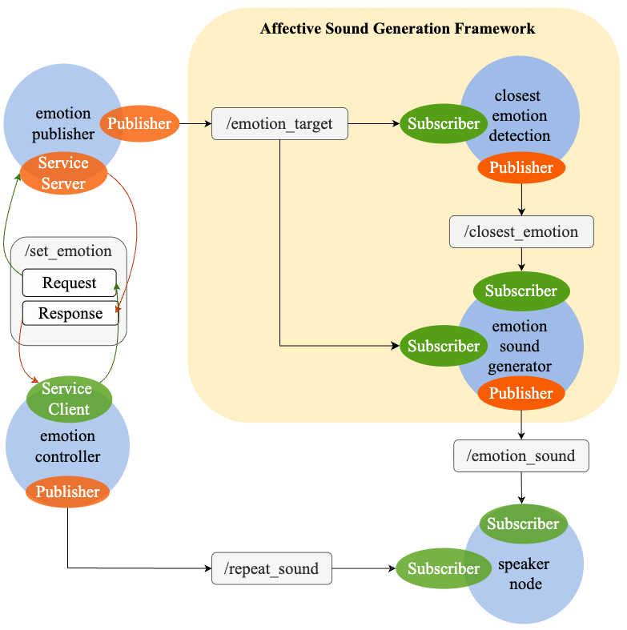

# Getting started

### Note 1 
If you are setting this up on your own laptop, then proceed in this README, if you are setting up either the turtlebot or a stretch3 robot, you could first follow the READMEs for these respective robots ``README_robot_turtlebot.md`` or ``README_robot_stretch3.md``

### Note 2 For Stretch3 robot users only
If you are not in the process of setting up a brand new Stretch robot, then you only need to follow instructions in section 0 of ``README_robot_stretch3.md`` and section 3 onwards of this readme, ``README.md`` otherwise follow all steps. 

### Documentation Maintainer(s)
Sonic-HRI workspace -> Vlatka Tolj (vlatka.tolj@student.kit.edu), Turtlebot4 & Stretch 3 robot -> Victoria Yang (victoria.yang@kit.edu)

## 1. Setting up the Sonic-HRI workspace

### 1.1 Repository contents

This repository contains all files required to run the project, including configuration files, pretrained models, and other project resources, located in the **resources** directory.

**Important:** You should save the **resources** folder **outside** your ROS 2 workspace (which you will create in Step 1.2).

> **Important notice**
> The commercial **Bleep** sound library is **not included** in this repository due to licensing restrictions. 
> If you want to reproduce the original robot voice generation used in the project, 
> you will have to get a separate license from:
> https://www.asoundeffect.com/sound-library/bleep-cute-robot-voice/


### 1.2 Create your workspace:
    
    mkdir -p ~/$WORKSPACE_NAME/src
    cd ~/$WORKSPACE_NAME/src

### 1.3 Ensure you’re still in the ~/$WORKSPACE_NAME/src directory and clone the sonic-hri project:

    git clone https://github.com/SARAI-Lab-KIT/sonic-hri.git

### 1.4 Install Python dependencies

These packages are required for the Evolutionary Strategy and other Python-based components.

```bash
pip3 install --user -r ~/$WORKSPACE_NAME/src/sonic-hri/python-requirements.txt
```

### 1.5 Install ROS package dependencies

Install the required ROS packages listed in `ros_requirements.txt`:

```bash
xargs -a ~/$WORKSPACE_NAME/src/sonic-hri/ros_requirements.txt \
    -I {} sudo apt install -y "ros-${ROS_DISTRO}-{}"
```

If required, install any remaining ROS dependencies using `rosdep`:

```bash
cd ~/$WORKSPACE_NAME
rosdep install --from-paths src --ignore-src -r -y
```


### 1.6 Build the workspace:

    colcon build

### 1.7 Source the workspace

    source install/setup.bash

### 1.7.1  Add to .bashrc (optional)

Add this line to ~/.bashrc, so you don't have to source your workspace every time you open a new terminal:

    echo "source ~/$WORKSPACE_NAME/install/setup.bash" >> ~/.bashrc

## 2. Setting up the code

Once your workspace is set up, you’ll need to update the local file paths in the following scripts to match your local setup:

- In **emotion_sound/emotion_sound_generator.py**, update the paths for ENCODER_CHECKPOINT_PATH, CONFIG_PATH, CLFR_PATH, BLEEP_DIR, OUTPUT_DIR.
- In **emotion_detection/closest_emotion_detection.py**, update the path for EXCEL_PATH.
- In **emotion_state/emotion_publisher.py**, update the EXCEL_PATH inside the EmotionPublisher class.

Edit these files and replace the paths with the appropriate paths from your environment.

After updating the paths, **don't forget to rebuild your workspace**.

## 3. Running the ROS2 nodes

Open 5 terminals and run the following:

### Terminal 1:
    cd $WORKSPACE_NAME/
    source install/setup.bash
    ros2 run emotion_state emotion_publisher

This starts the emotion_publisher node, which:
- publishes target valence and arousal to the topic /emotion_target,
- hosts the /set_emotion service, used to change the target emotion via keyboard.

### Terminal 2:
    cd $WORKSPACE_NAME/
    source install/setup.bash
    ros2 run emotion_detection closest_emotion_detection

This starts the closest_emotion_detection node, which:
- subscribes to /emotion_target to get the target valence and arousal,
- finds the closest emotion to the target values,
- publishes the closest emotion and source_folder to the topic /closest_emotion.

### Terminal 3:
    cd $WORKSPACE_NAME/
    source install/setup.bash
    ros2 run emotion_sound emotion_sound_generator

This starts the emotion_sound_generator node, which:
- subscribes to 2 topics: /emotion_target to get the target valence and arousal, and /closest_emotion to get the source_folder string,
- takes that as input and runs the Evolutionary Strategy (ES), 
- saves the transformed sound and publishes its path to /emotion_sound.

### Terminal 4:
    cd $WORKSPACE_NAME/
    source install/setup.bash
    ros2 run emotion_speaker speaker_node

This starts the speaker_node, which:
- subscribes to /emotion_sound for the sound path and plays the audio,
- listens to /repeat_sound for replaying the last audio on request.

### Terminal 5:
    cd $WORKSPACE_NAME/
    source install/setup.bash
    ros2 run emotion_state emotion_controller

This starts the emotion_controller node, which:
- takes keyboard input for target emotion,
- sends target emotion to the /set_emotion service (hosted by emotion_publisher), 
- publishes repeat messages to /repeat_sound when "r" is pressed.




*Figure 1: Overview of the Sonic HRI ROS 2 pipeline.*

## 4. Troubleshooting

Common issues:

### Error: No module named 'clmr'
When running:

    ros2 run emotion_sound emotion_sound_generator

You get the error:

    ModuleNotFoundError: No module named 'clmr'

#### Reason:

clmr/ is located outside the workspace and Python cannot find it.

#### Solution:

Add clmr/ to sys.path in sonic-hri/src/emotion_sound/emotion_sound/emotion_sound_generator.py before the clmr import:

    import sys
    sys.path.append("/home/$USER_NAME/path/to/your/clmr")


**Don't forget to do colcon build afterwards!**

Do this instead of moving the clmr/ inside the workspace, since the clmr/ folder contains a nested clmr/. 
Moving it into the workspace would cause a duplicate package name error when running colcon build, 
since ROS 2 does not allow multiple packages with the same name in one workspace.

> **Note:** Should you encounter any other issues, let me (vlatka.tolj@student.kit.edu) know, so I can update this accordingly.


## Related publication

This repository accompanies the following paper, accepted at the IEEE/RSJ International Conference on Intelligent Robots and Systems (IROS 2026):

Paper link and DOI TBA

