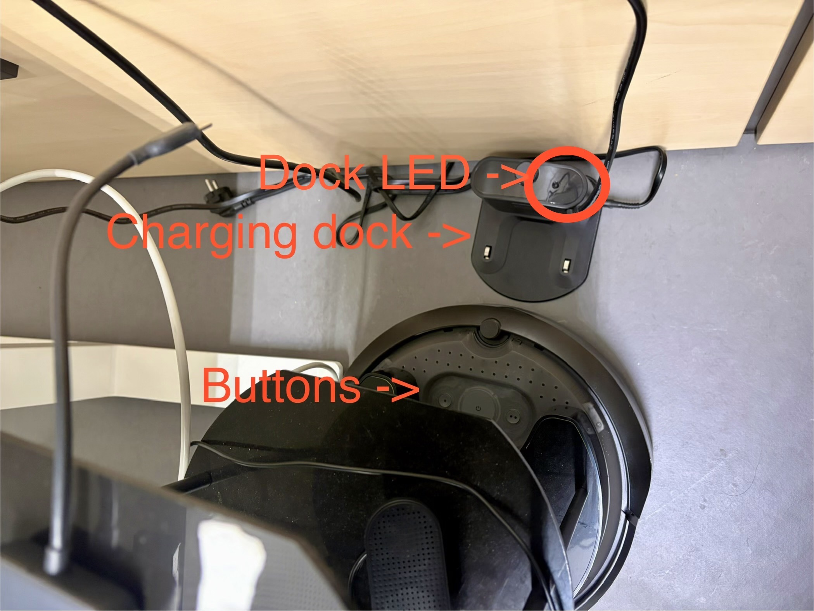
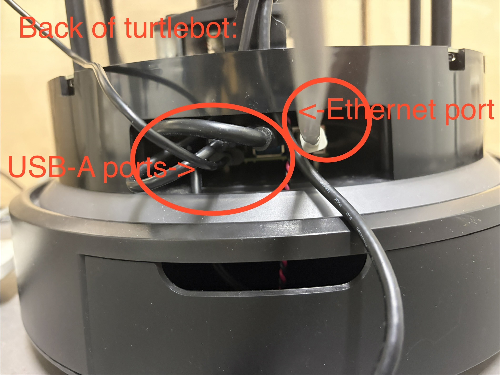
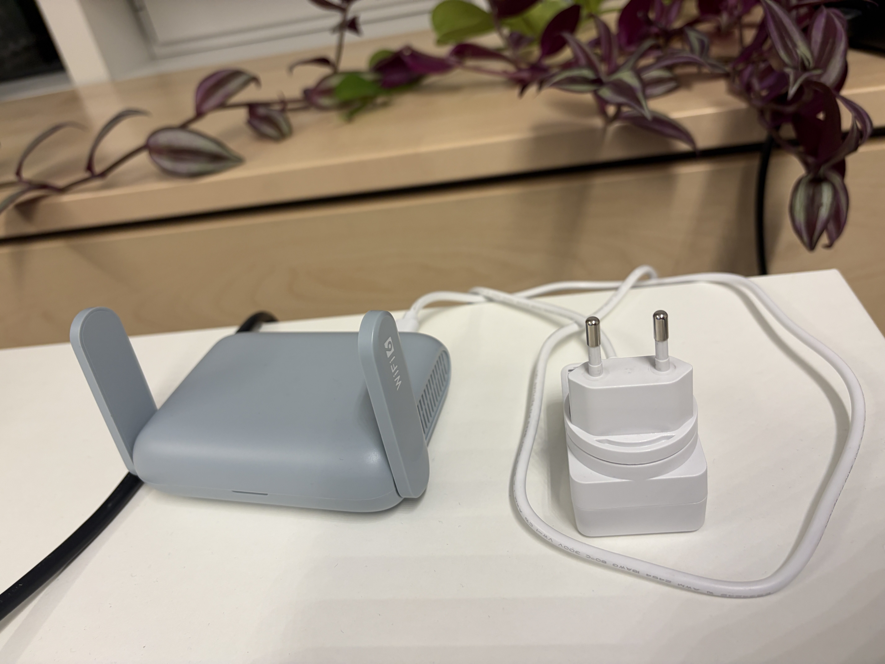
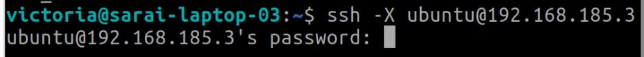

# Getting started

Maintainer(s): Victoria Yang (victoria.yang@kit.edu)

---
## 0. Setting up Turtlebot4

### 0.1 Power on Turtlerobot
Put the Turtlebot power dock such that it is against the wall and connect the dock to a power socket. Then place the robot on the dock with the buttons facing the dock, if the connection is successful then you will see a green light on top of the dock. Then wait a few minutes for the robot to power on, you should hear beeping sounds from the robot and also lights turn on which signalizes it is fully powered on.

#### 0.1.1 When you are finished using Turtlebot

When you are finished using the robot Power off the turtlebot by removing it from the dock and then press on the center round button until you hear beeping music and all the lights turn off on the robot.

### 0.2 Connecting your computer to the Turtlebot and starting an SSH session
The ports of the raspberry pi inside the robot can be accessed at the back and bottom of the robot. You should see the ethernet port and USB A ports. 

#### 0.2.1 (optional) Turn on the Turtlebot router for Wi-Fi
Plug the pre-configured router (looks like the one in the image below) for the turtlebot to a power socket. The robot should automatically connect. 

#### 0.2.2 Connect via ethernet cable
Connect the the robot and your computer using an ethernet cable.

#### 0.2.3 SSH into robot
In your terminal, run the following to start an SSH session in the robot:

    ssh -X ubuntu@<your-robot-ip>

The password is: 

    <your-robot-password>

Repeat this for every new terminal you open for all remaining step up steps.

Note: If the Turtlebot is availble to connect to, you should see a prompt appear in the terminal asking for the password for the Turtlebot. Otherwise, you should get a prompt from the terminal saying connection not availble. 

### 0.3 Connecting USB speaker to turtlebot
#### 0.3.1 Connect speaker to the robot
Connect the USB speaker to the USB ports on the raspberry pi inside the robot.

#### 0.3.2 Check the connection
In your terminal (that has a working ssh session), run the following:

    cat /proc/asound/modules

You should see the following output:
~~~ini
    0 snd_bcm2835   # system
    1 snd_usb_audio # usb speaker
~~~

Note: the Turtlebot should already have this setting set, but check this in case if there are issues where all nodes in steps 3.x. are running without issue but no sound is coming from the speaker. 

#### 0.3.3 Audio settings to use the speaker
Settings to play through speaker are saved in a file called (`~/.asoundrc`) located in the home directory.

Run the follow command to check the settings in (`~/.asoundrc`), which should look like the output below (the card 1 means it is through the usb speaker):

    cat ~/.asoundrc

Example `~/.asoundrc` output:
~~~ini
    pcm.!default {
        type hw
        card 1
    }

    ctl.!default {
        type hw
        card 1
    }
~~~

#### 0.3.4 (optional) Volume settings
Command to check the sound level:

    amixer

Sondlevel output example:
~~~ini
    Simple mixer control 'PCM',0
    Capabilities: pvolume pswitch pswitch-joined
    Playback channels: Front Left - Front Right
    Limits: Playback 0 - 147
    Mono:
    Front Left: Playback 44 [30%] [-20.16dB] [on]
    Front Right: Playback 44 [30%] [-20.16dB] [on]
~~~

Adjust volume level using the following command template:

    amixer set PCM <volume percentage or a number 0-147>

Full volume example:

    amixer set PCM 100%

Save the volume setting to persist upon reboot: 

    sudo alsactl store
---